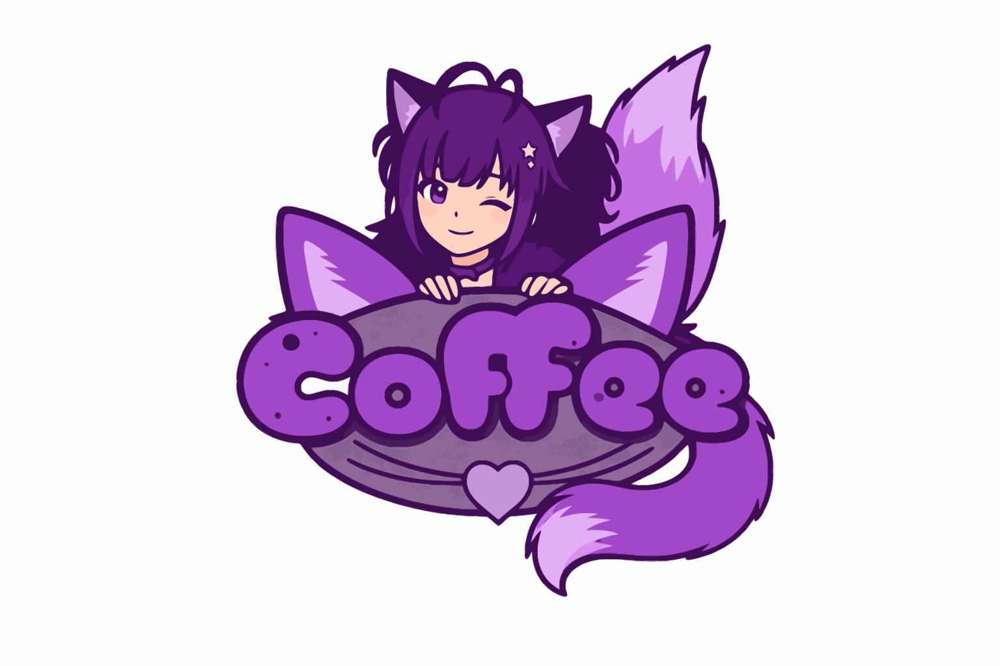

<div align="center">



# CoffeeJG VTubing Course

**The all-in-one platform for becoming a 3D VTuber.**

Video courses. Curated resources. One subscription.

[](https://nextjs.org)
[](https://typescriptlang.org)
[](https://firebase.google.com)
[](https://stripe.com)
[](https://vercel.com)

</div>

---

<br/>

## Overview

A full-stack education platform built for **CoffeeJG** — teaching everything from model setup to going live as a 3D VTuber. Two connected products share a single auth system:

| | Product | What it does |
|:---:|---|---|
| **01** | **Course Platform** | Paid video lessons with progress tracking, Stripe payments (monthly or lifetime), and gated content |
| **02** | **Resource Hub** | 176+ free curated VTuber assets — models, rigs, textures, animations — searchable and filterable |
| **03** | **Admin CMS** | Course/lesson editor with Plate.js, user management, enrollment controls |

<br/>

## Tech

```
Framework       Next.js 16 · App Router · Server Components · Server Actions
Auth            Firebase Auth · Email/Password + Google · Session Cookies
Database        Firestore · Firebase Admin SDK · Server-side only
Payments        Stripe Checkout · One-time + Subscriptions · Webhook-driven
Video           Vimeo + YouTube · Plyr custom player · Server-resolved URLs
Styling         Tailwind CSS · shadcn/ui · oklch color system
Language        TypeScript · Strict mode
Hosting         Vercel
```

<br/>

## Features

### Courses & Payments

- Step-by-step video lessons with completion tracking and progress bars
- **Two plans:** monthly subscription ($5/mo) or lifetime access ($2 one-time)
- Stripe Checkout with webhook-driven enrollment — success page never writes data
- Cancel at period end, resume, or upgrade monthly to lifetime
- Billing portal, invoice history, live subscription status in settings

### Resource Hub

- **176+ curated assets** across Ko-fi, Booth, VGen, and Gumroad
- Full-text search, tag filters, source filters
- Favorite system with optimistic UI
- Paginated grid with detail modals

### Admin

- Rich text lesson editor (Plate.js)
- User search by email, name, or UID
- Enrollment management: revoke, cancel subscription, delete account
- All admin actions cascade to Stripe (no orphaned subscriptions)

<br/>

## Security

This isn't a toy project. Payment security is treated seriously.

| Layer | Implementation |
|---|---|
| **Auth** | Firebase session cookies with server-side verification and revocation checks |
| **Bot Protection** | Cloudflare Turnstile on login, signup, and forgot-password — server-side token verification |
| **Payments** | Stripe webhook signature verification, transactional event dedup, idempotent enrollment creation |
| **Access** | Server-side only — enrollment doc existence = access. Firestore rules deny all client reads/writes |
| **Video** | Vimeo IDs resolved server-side via `/api/video`. Custom Plyr controls hide native chrome. Right-click disabled. Never leaked to client or RSC payloads |
| **Headers** | HSTS, X-Frame-Options DENY, CSP permissions, no X-Powered-By |
| **Input** | All user-supplied IDs validated against `^[a-zA-Z0-9_-]{1,128}$` before Firestore queries |
| **Webhooks** | Transactional claim prevents concurrent duplicate processing. Failed events unclaimed for retry |

<br/>

## Architecture

```
                          ┌─────────────────┐
                          │    Browser       │
                          └────────┬────────┘
                                   │
                          ┌────────▼────────┐
                          │  Next.js on     │
                          │  Vercel         │
                          └──┬───┬───┬───┬──┘
                             │   │   │   │
                ┌────────────┘   │   │   └────────────┐
                │                │   │                 │
       ┌────────▼──┐   ┌───────▼───▼──┐      ┌──────▼──────┐
       │ Firebase   │   │  Firestore   │      │   Stripe    │
       │ Auth       │   │  (all data)  │      │  (payments) │
       └────────────┘   └──────────────┘      └─────────────┘
```

**Core invariants:**
- Enrollment doc = course access. No denormalized arrays.
- Webhook is the **only** enrollment creator. Success page is read-only.
- All mutations are idempotent. Retries and duplicate webhooks are safe.
- Composite IDs (`uid::courseId`) enforce structural uniqueness.

> Full system design in [`docs/architecture.md`](docs/architecture.md) and version history in [`docs/changelog.md`](docs/changelog.md).

<br/>

## Getting Started

### Prerequisites

- Node.js 22+
- Firebase project (Auth + Firestore)
- Stripe account with webhook endpoint
- Vimeo account for video hosting

### Setup

```bash
# Clone
git clone https://github.com/drewfoos/coffeejg-course.git
cd coffeejg-course

# Install
npm install

# Configure environment
cp .env.example .env
# Fill in Firebase, Stripe, and Vimeo credentials

# Seed database (optional)
npm run seed

# Start dev server
npm run dev
```

<details>
<summary><strong>Environment Variables</strong></summary>

<br/>

| Variable | Description |
|---|---|
| `FIREBASE_PROJECT_ID` | Firebase project ID |
| `FIREBASE_CLIENT_EMAIL` | Firebase service account email |
| `FIREBASE_PRIVATE_KEY` | Firebase service account private key |
| `NEXT_PUBLIC_FIREBASE_*` | Firebase client SDK config (6 vars) |
| `STRIPE_SECRET_KEY` | Stripe API secret key |
| `STRIPE_WEBHOOK_SECRET` | Stripe webhook signing secret |
| `STRIPE_LIFETIME_PRICE_ID` | Price ID for lifetime plan |
| `STRIPE_MONTHLY_PRICE_ID` | Price ID for monthly subscription |
| `NEXT_PUBLIC_APP_URL` | App URL for Stripe redirects |
| `NEXT_PUBLIC_TURNSTILE_SITE_KEY` | Cloudflare Turnstile site key |
| `TURNSTILE_SECRET_KEY` | Cloudflare Turnstile secret key |
| `ADMIN_UIDS` | Comma-separated Firebase UIDs for admin access |

See `.env.example` for the complete list.

</details>

<br/>

## Scripts

| Command | What it does |
|---|---|
| `npm run dev` | Start development server |
| `npm run build` | Production build |
| `npm run start` | Start production server |
| `npm run lint` | Run ESLint |
| `npm run seed` | Seed course + assets |
| `npm run seed:course` | Seed sample course with lessons |
| `npm run seed:assets` | Seed 176 resource hub assets |

<br/>

## Project Structure

```
src/
  app/
    admin/                  # CMS — courses, lessons, users
    api/webhook/stripe/     # Stripe webhook handler
    courses/                # Course pages + lesson viewer
    resources/              # Resource hub + favorites
    pro/                    # Pricing page
    settings/               # Account + subscription management
  components/
    admin/                  # Admin UI (forms, buttons, search)
    course/                 # Buy button, lesson sidebar, Plyr video player
    resources/              # Asset cards, filters, search
    settings/               # Cancel/resume subscription
    layout/                 # Navbar, footer
    ui/                     # shadcn/ui + custom primitives
  lib/
    actions/                # Server Actions (checkout, billing, admin)
    auth/                   # Session cookies, user doc creation
    firebase/               # Client + Admin SDK init
    firestore/              # Query functions (enrollments, assets, users)
    vrm/                    # VRM model + Mixamo animation utils
scripts/                    # Seed scripts, asset pipeline tools
docs/                       # Architecture docs, changelog
```

<br/>

---

<div align="center">

Built by [drewfoos](https://github.com/drewfoos) for CoffeeJG

</div>
